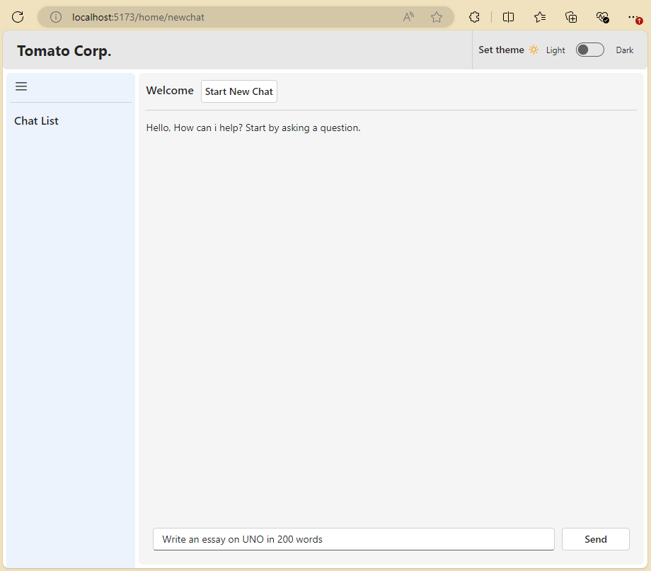

ReactFluentUIGenAIChatWebApp

# ReactFluentUIGenAIChatWebApp
* Experimenting with creating a Chat GPT like (not exact) interface with React and FluentUI
* Scaffolding was done using **VITE**
* Required env variables `VITE_API_URL`,`VITE_MSAL_CLIENT_ID`,`VITE_MSAL_TENANT_ID`
* Started with Starter React and Fluent UI repo which I wrote to act as a template. https://github.com/pkaushik23/ReactFluentStarter

* Added support of streaming response. try the streaming api respoonse from : https://github.com/pkaushik23/AzFuncPyFastApi; `VITE_API_URL` should have the api endpoint.

# Lessons learnt

1. For some reason when trying to deploy on the **Azure Static Web App**, the _NavBar_ **component was not loading**, and hence app was not working. Renamed the NavBar component to something else and it worked. Currenlty have both in place for futher analysis _NavBar_ and _RiteNavBar_
2. The **Enviroment Variables** in the Vite React application **did not** work with **Azure Static Web** Apps. To SOLVE, 

    a. Created a environment in GITHUB
    
    b. Configured same environment name on the deployment workflow file

    c. In the workflow, created build level environment variable and populatd them with values from 
    Git hub environment variables.

    d. Then use them as usual, like how we do in Vite.ex: `import.meta.env.VITE_API_URL`
    
3. 

